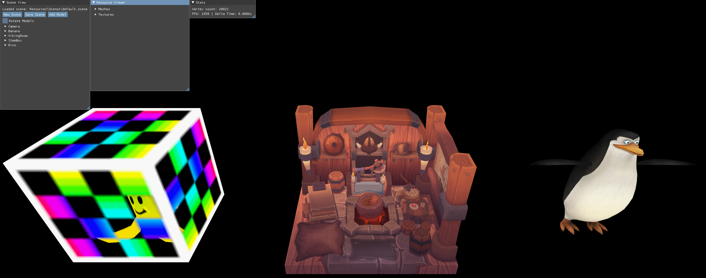
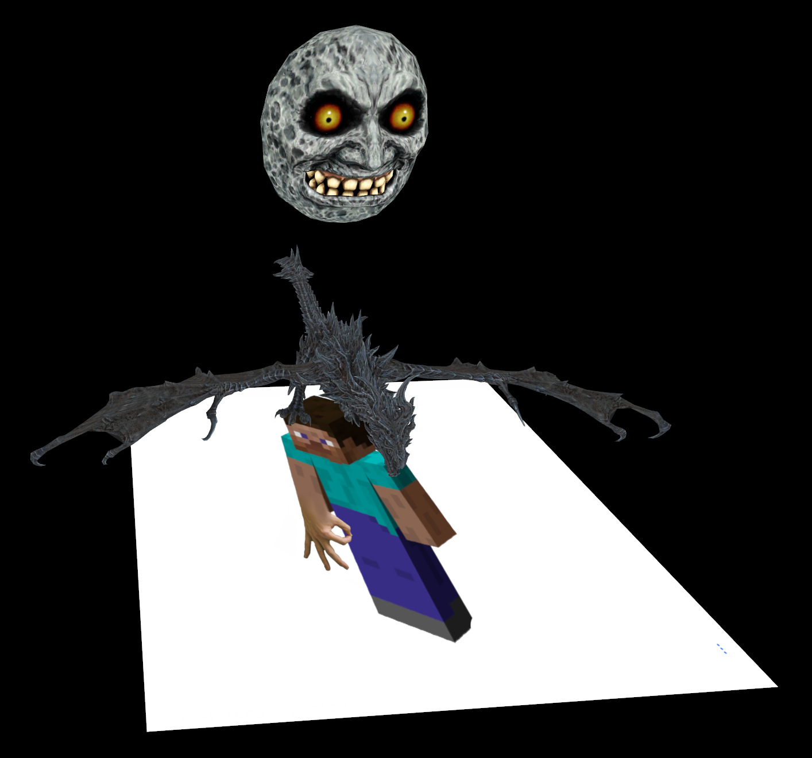
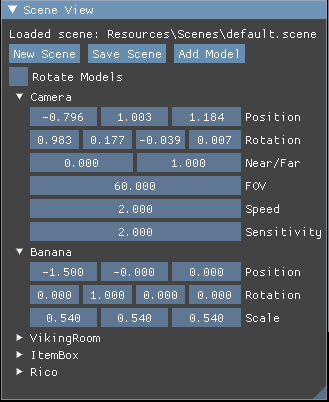
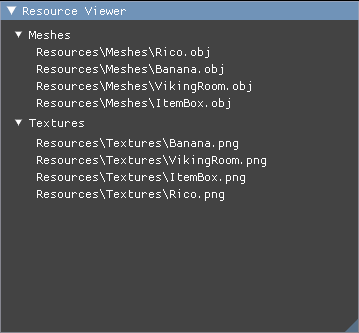
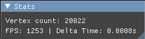

# **Initiation to Modern Graphics APIs**

### General Information

This project was made for the ISART Digital school by Rémi Serra.  
The goal was to understand how a modern graphics API such as Vulkan is used in video games and to learn the structural challenges behind it.

### Screenshots

### Features

- Rendering of meshes and textures using Vulkan
- Loading of .objs and images at runtime
- Scene loading, editing and saving
- Use of custom maths for vectors, matrices and quaternions
- Right-click a model in the scene view to rename or remove it
- Right-click a mesh or a texture in the resource viewer to unload it
- Drag and drop a .obj, .png or .jpg file onto the window to load it into the scene
- Drag and drop a .scene file to load its contents and resources
